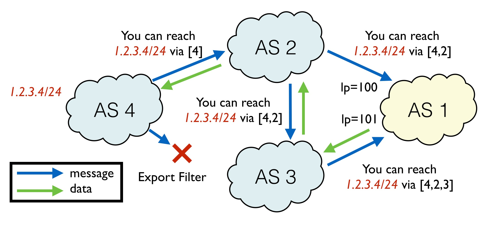
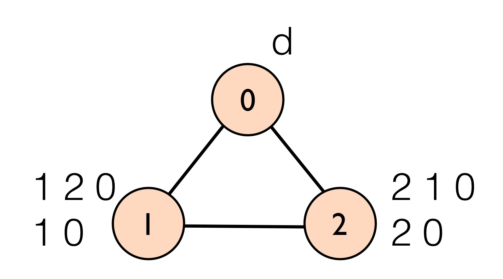
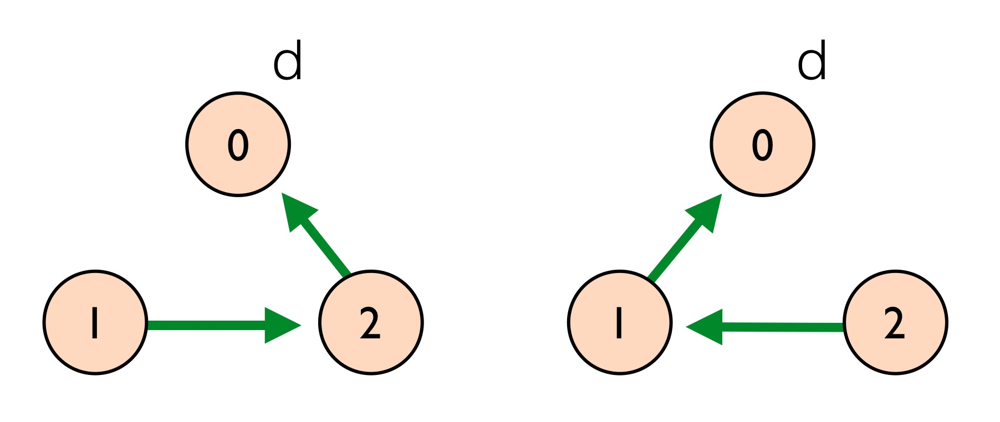
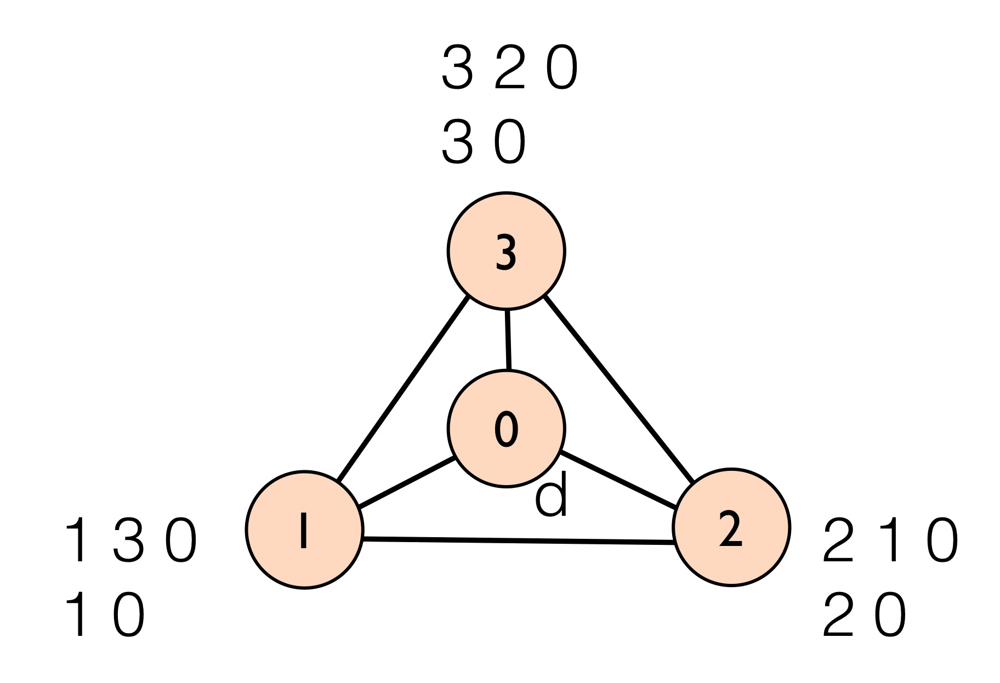

## BGP Overview

The Border Gateway Protocol (BGP) is a path vector protocol that enables interdomain routing among different administrative entities, referred to as autonomous systems (ASes). BGP was designed to be both highly scalable, to deal with the large size of the internet, and highly flexible, allowing separate ASes to configure their own policy locally.
Local policy is important since different ASes often have competing financial interests. For example, an AS may wish to avoid carrying traffic for which it is not being paid, yet would like other ASes to carry its traffic for free. As a result, satisfying local policies at each AS takes precedence in BGP over computing the shortest path to the destination.

BGP has also seen increasing use as an IGP for intradomain routing. One reason for this due to the scalability of the protocol. For example BGP is used for routing in large datacenter networks at Micrsoft and Facebook, which can consist of thousands of routers. Another reason for this is because traditional IGPs are based on shortest path routing and offer little in the way of user policy. For example, BGP allows operators to write different policies for different prefix destinations.

Unfortunately, the flexibility offered by BGP local policy combined with the low-level nature of BGP configurations means that BGP is a very difficult protocol to configure correctly. This difficulty leads to a number of problems ranging from configuration inconsistencies to route oscillation to aggregation-induced black holes. 

## How the Protocol Works

In BGP, ASes compute forwarding routes by exchanging BGP routing announcements with their neighbors. Each announcement contains:

  * A destination IP prefix
  * An AS path indicating the path to the destination through this neighbor
  * A local-preference value indicating route preference (higher is better)
  * A set of user-defined community tags that color routes (e.g., "entered on the west coast")
  * A number of other attributes such as the Multi-exit Discriminator (MED)

An announcement for a destination IP prefix indicates that the neighbor is willing to carry traffic for the IP prefix along the specified AS path. Every route announcement received by an AS is processed by the following steps:

  1. Reject a route if our AS is already in the AS path (to prevent loops)
  2. Apply custom import filters. These can drop certain announcements (e.g. if it does not contain a certain community tag) or modify values (e.g., set the local preference to 101)
  3. Select the best route among all announcements from different peers by choosing the one with the best local preference. If there are multiple best routes according to local preference, use path length as a tie-breaker.
  4. For each neighbor, apply a neighbor-specific export filter, which can either drop the new announcement for the (choosen) best path, or modify values (e.g., by adding a new community tag).

In the example above, AS 4 owns the destination prefix 1.2.3.4/24. The AS will advertise the prefix to all neighbors with the AS path [4]. Because AS 4 has an export filter to neighbor AS 3, the advertisement will be dropped. AS 2 receives the advertisment and selects it as the best (and only) path to the destination. AS 2 then advertises the prefix to each peer after updating the AS path to be [2,4]. AS 3 will then similarly accept the route to the destination and advertise the route to neighbor AS 1. Finally, AS 1 has an import filter for AS 2 that will set the local preference attribute to be 100, and a separate import filter for AS 3 that will set the local preference attribute to be 101. Since a higher local preference is preferred, AS 1 will use the path [3,2,4] from AS 3.

## Stable Paths

Most routing protocols (e.g., OSPF, ISIS, RIP, EIGRP) compute a shortest path tree in a distributed manner. However, in BGP, the inclusion of local preferences means that the forwarding paths computed may not be the shortest. Instead, BGP attempts to compute a routing tree that is **stable**. A stable routing tree will have the following two properties:

  1. Next-hop forwarding: router X has a path P = Y,P' only if X is connected to Y and router Y has a path P'
  2. Stability: No router has a more preferred path available.

Consider the following BGP topology:

In the topology, AS 0 owns the destination prefix **d**. AS 1 has ranked paths by preference so that it prefers the longer path that goes through neighbor 2 over the direct path through 0. Similarly, AS 2 prefers to send traffic through neighbor 1 over a direct path to 0. There are two stable routing trees for this example, which are shown below:

In the first routing tree (left), AS 1 satisfies the stability condition since it will use its most preferred path through AS 2. AS 2 also satisfies the stability condition because, although it is using its less preferred path directly through 0, its more preferred path through 1 is not available since its neighbor 1 will not advertise this path. The other symmetric routing tree (right) is also stable. Different BGP message orderings can lead to either stable solution.

## Route Instability

A well-known problem with BGP is that conflicting local policies can lead to route oscillation, where BGP never converges to a stable forwarding state. This happens when there is no stable routing tree. Perhaps the most well-studied example of this problem is the Bad Gadget depicted below. 

In this example, each of ASes 1,2, and 3 prefer to route traffic through their neighbor over the direct route to the destination at AS 0 in a circular dependency. To see why BGP will never converge, see if you can draw a stable routing tree for the Bad Gadget example.