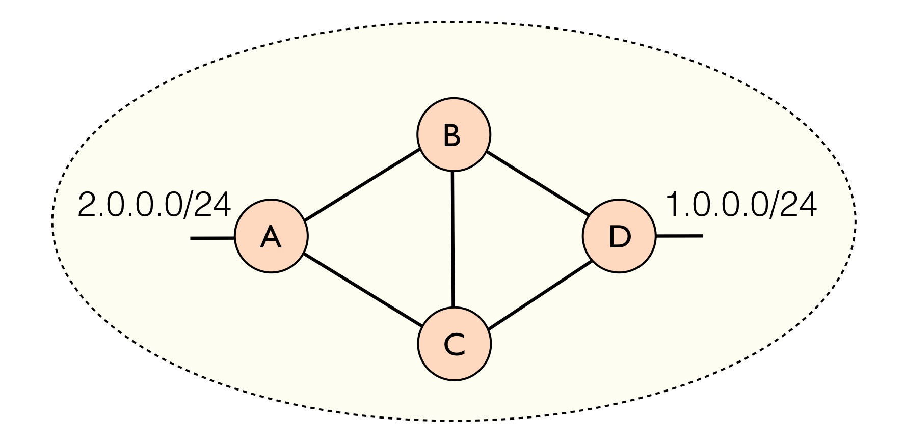
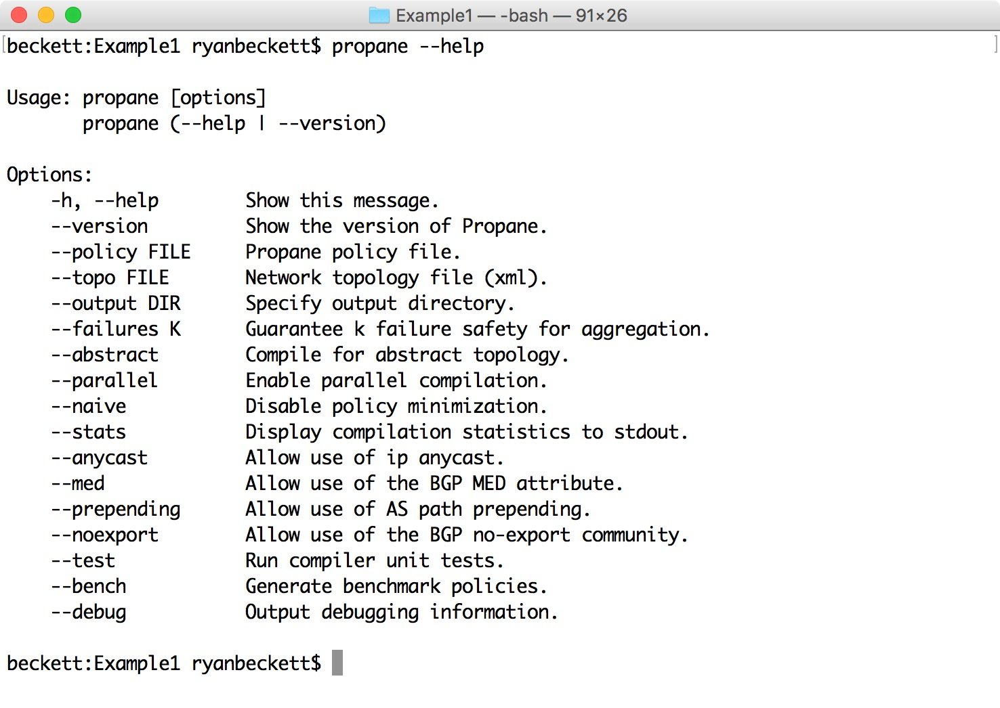
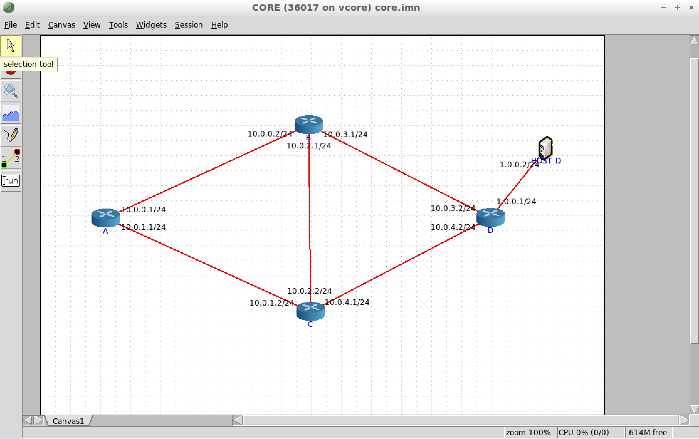
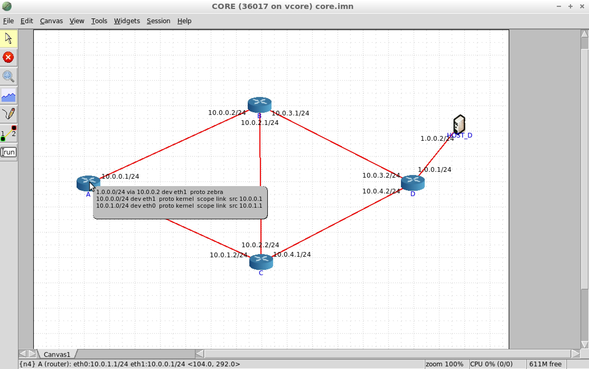
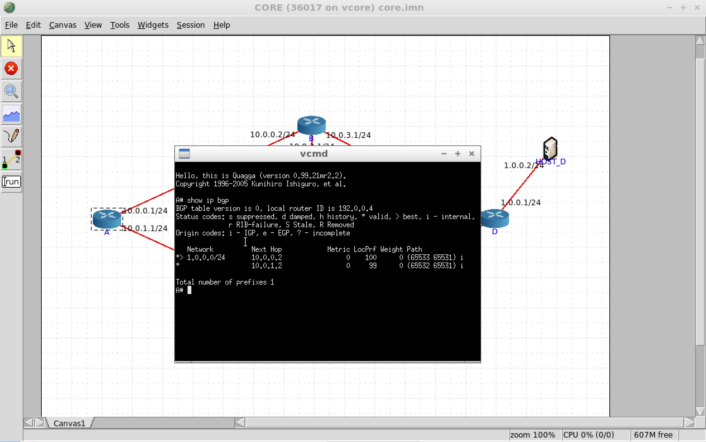
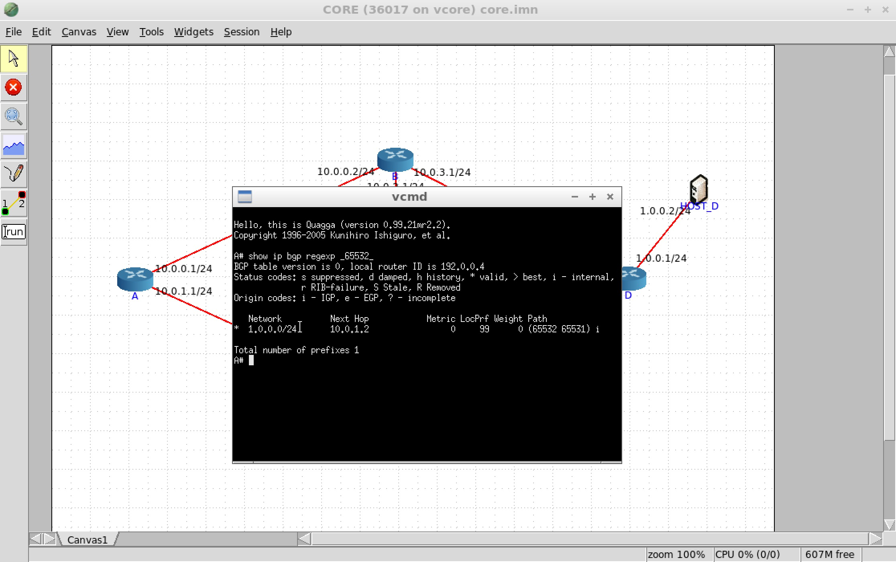
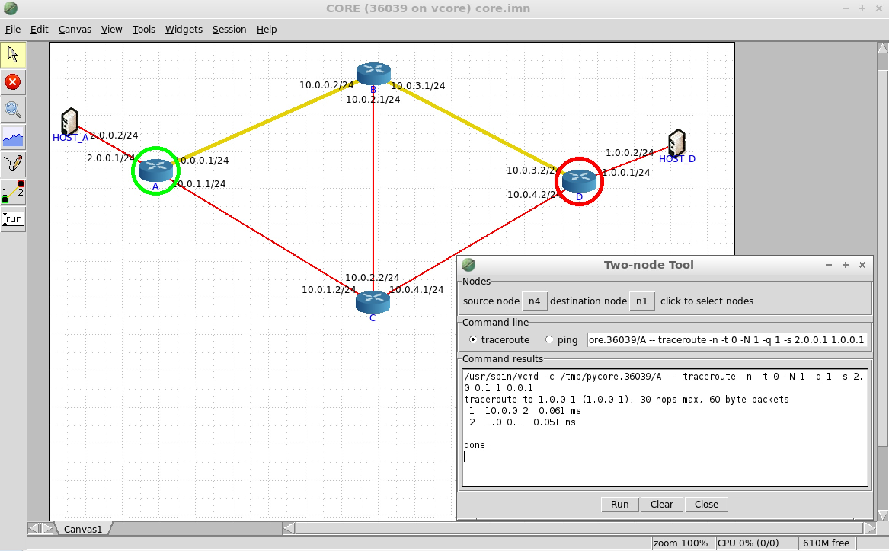
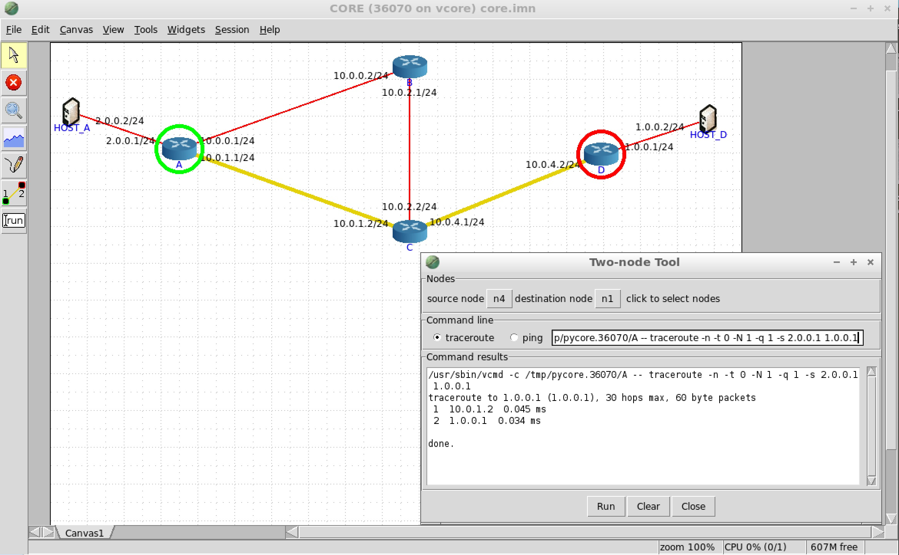

## Motivation

**Propane** aims to simplify network configuration by letting users write a single network-wide routing policy at a high level of abstraction. These policies can say things like "avoid China Telecom", or "prevent transit traffic", or "prefer link X over link Y". In particular, the policy makes no reference to any BGP-specific features (e.g., local preference, community tags, filters) despite the fact that the policies are in fact compiled to BGP.

## A First Program

Let us look at a simple configuration example to get familiar with the Propane toolchain. To start, go to `Example1` in the Propane tutorial directory `cd ~/Desktop/propane/examples/tutorial/Example1`. There are two files in this directory: `ex1.xml` and `ex1.pro`. The xml file, shown below, is a description of the topology.

**ex1.xml**

    <topology asn="100">
      <node internal="true" name="A"></node>
      <node internal="true" name="B"></node>
      <node internal="true" name="C"></node>
      <node internal="true" name="D"></node>
      <edge source="A" target="B"></edge>
      <edge source="A" target="C"></edge>
      <edge source="B" target="C"></edge>
      <edge source="B" target="D"></edge>
      <edge source="C" target="D"></edge>
    </topology>

The topology describes abstract locations and edges between them. The first line says that the network we are configuring will have Autonomous System number `100`. Each location in the topology is marked as either internal, that is, a router under the control of the network being configured, or external (i.e., a peer AS). In this case, we will be configuring a network's intradomain routing policy only since there are no external peers. Since Propane will generate an eBGP configuration for every router in the operator's network, we can optionally specify an AS number for the internal routers as well by writting something like this:

    <node internal="true" name="A" asn="65000"></node>

If the AS number is left off for internal routers, as is the case in the above topology, Propane will automatically generate and manage BGP private AS numbers for internal routers. Similarly, Propane will automatically generate interface IP addresses for the user if otherwise unspecified.

In this example, we will be configuring routes between routers **A** and **D** inside our network, which own the subnets `2.0.0.0/24` and `1.0.0.0/24` respectively. The full topology is shown below. 

 

The second file `ex1.pro` is a Propane file with the following policy:

**ex1.pro**

    define main = {
      1.0.0.0/24 => path(A,B,D) >> path(A,_,D),
      true => drop
    }

Every Propane policy contains a series of definitions, along with a `main` definition that describes the overall routing policy. In this case, the `main` definition is describing a constraint block, denoted by the curly braces. Constraint blocks associate traffic predicates (left) with path constraints (right) and describe how traffic matching the predicate on the left is allowed to move through the network.

The first line says that traffic destined for the `1.0.0.0/24` subnet should follow the top path `A,B,D` whenever possible. If this is not possible due to failures, then any path that starts at `A` and ends at `D` can be used as a backup. The underscore `_` matches any sequence of locations. When neither of these is possible, for example if the network becomes partitioned and A can no longer reach D, then there is an implicit lowest preference to `drop` the traffic.

The second line matches any other traffic that did not match `1.0.0.0/24` (`true`) and adds the constraint that the traffic should be dropped. In other words, there is no valid path allowed for any other type of traffic. Note that this is a network-wide `drop`.

## Compiling Propane

Lets compile the above Propane policy. To do so, run the following command from the `Example1` directory:

    propane --policy ex1.pro --topo ex1.xml

There should now be a new directory called `output/`. This is the default compilation output directory, however a different output directory can be specified using the `--output DIR` command line flag. For the full list of command line flags you can run `propane --help`.

 

If you look in the generated `output/` directory, there will be a number of new files. 

  * `config.ir`: A high-level representation of the BGP policy
  * `configs/`:  A directory with actual Quagga configurations for each router
  * `core.imn`:  A complete CORE emulator environment for the policy

### Abstract BGP

The first file: `configs.ir` is an high-level BGP policy representation used by Propane. This representation makes it easier to understand how the policy is being implemented. For example, if we look at the `config.ir` file:

**config.ir**

    Router D
      origin:  [1.0.0.0/24] [export peer<-*]
      deny:    [0.0.0.0/0 le 32]

    Router C
      allow:   [1.0.0.0/24], peer=B [export peer<-*, comm<-1]
      allow:   [1.0.0.0/24], peer=D [export peer<-*, comm<-1]
      deny:    [1.0.0.0/24]
      deny:    [0.0.0.0/0 le 32]

    Router B
      allow:   [1.0.0.0/24], peer=D [export peer<-*, comm<-2]
      allow:   [1.0.0.0/24], peer=C [export peer<-*] (lp=99) 
      deny:    [1.0.0.0/24]
      deny:    [0.0.0.0/0 le 32]

    Router A
      allow:   [1.0.0.0/24], peer=B, comm=2 [export peer<-*]
      allow:   [1.0.0.0/24], peer=*, comm=1 [export peer<-*] (lp=99) 
      deny:    [1.0.0.0/24]
      deny:    [0.0.0.0/0 le 32]

This file summarizes what the actual BGP configurations are doing.
We can see that router D will originate an advertisement for the prefix `1.0.0.0/24` and export the route to all of its neighbors `export peer<-*`. 

For this prefix, router C will accept an advertisement from either D or B and export the route to all of its peers after attaching a BGP community value of `1` to the advertisement. 

Router `B` will match an advertisement coming from `D` with the default local preference of `100`, and it will attach the BGP community value of `2` to the advertisement before sending it to all peers. It will also allow advertisements coming from `C` and assign a lower (worse) local preference (`lp`) of `99`. These will also be advertised to all peers, and the community value will remain unchanged.

Finally, router `A` will prefer routes from neighbor `B` with the community `2` attached, since this indicates that the path `A,B,D` will be used. Otherwise `A` will use any other path to `D`, which is indicated by advertisements that have the community value `1` attached.

### Quagga Configurations

The `configs/` directory contains the actual concrete BGP configurations for Quagga routers. There will be one configuration for each router. For example, below is the configuration for router B. As you can see, these configurations are very low level.

**B.cfg**

    interface eth0
     ip address 10.0.3.1/24
    !
    interface eth1
     ip address 10.0.2.1/24
    !
    interface eth2
     ip address 10.0.0.2/24
    !
    router bgp 65533
      no synchronization
      bgp router-id 192.0.0.3
      bgp always-compare-med
      bgp deterministic-med
      bgp bestpath compare-routerid
      bgp bestpath as-path confed
      bgp confederation identifier 100
      bgp confederation peers 65531 65532 65534
      neighbor 10.0.3.2 remote-as 65531
      neighbor 10.0.3.2 next-hop-self
      neighbor 10.0.3.2 send-community both
      neighbor 10.0.3.2 advertisement-interval 5
      neighbor 10.0.2.2 remote-as 65532
      neighbor 10.0.2.2 next-hop-self
      neighbor 10.0.2.2 send-community both
      neighbor 10.0.2.2 advertisement-interval 5
      neighbor 10.0.0.1 remote-as 65534
      neighbor 10.0.0.1 next-hop-self
      neighbor 10.0.0.1 send-community both
      neighbor 10.0.0.1 advertisement-interval 5
      neighbor 10.0.3.2 route-map rm-in in
      neighbor 10.0.3.2 route-map rm-export-1 out
      neighbor 10.0.2.2 route-map rm-in in
      neighbor 10.0.2.2 route-map rm-export-1 out
      neighbor 10.0.0.1 route-map rm-in in
      neighbor 10.0.0.1 route-map rm-export-1 out
    !
    ip prefix-list pl-1 permit 1.0.0.0/24
    ip prefix-list pl-2 deny 1.0.0.0/24
    ip prefix-list pl-3 deny 0.0.0.0/0 le 32
    !
    ip community-list standard cl-1 permit 100:1 
    ip community-list standard cl-2 permit 100:2 
    ip community-list standard LOCAL permit 100:1 100:2 
    !
    ip as-path access-list path-1 permit ^\(?(65531|65532|65534)_
    ip as-path access-list path-2 permit ^\(?65531_
    ip as-path access-list path-3 permit ^\(?65532_
    !
    route-map rm-in permit 10
      match ip address prefix-list pl-1
      match as-path path-2
      set community additive 100:1 
    !
    route-map rm-in permit 20
      match ip address prefix-list pl-1
      match as-path path-3
      set local-preference 99
      set community additive 100:2 
    !
    route-map rm-in permit 30
      match ip address prefix-list pl-2
    !
    route-map rm-in permit 40
      match ip address prefix-list pl-3
    !
    route-map rm-export-1 permit 10
      match community cl-1
      set comm-list LOCAL delete
      set community additive 200:2 
    !
    route-map rm-export-1 permit 20
      match community cl-2
      set comm-list LOCAL delete
    !

## Testing Propane

The last file: `core.imn`, provides a complete emulation environment to actually run the configurations on the Quagga router software using the [CORE](http://www.nrl.navy.mil/itd/ncs/products/core) network emulator. We can load the file directly using CORE. Run the following command to launch CORE with the generated environment:

    core-gui output/core.imn

This should bring up the CORE GUI with our topology and configurations already loaded. 
Using the selection tool in the left-hand toolbar, you can arrange the routers in the topology to match the picture from before. In this case, the Propane compiler has recognized that router D owns the `2.0.0.0/24` subnet, so it has attached a host to this router.

 

Next, start the emulator by clicking the **green start button** from the left-hand toolbar. You should see green boxes appear around each device. It may take the emulator a minute or so to converge to a stable BGP solution. We can view the forwarding behavior for each router by selecting **magnifying glass** in the toolbar and then selecting to view `IPv4 routes`. Then simply mouse over a router to view a summary of its forwarding behavior. Here we can see that router A will send traffic for `1.0.0.0/24` to the next hop address `10.0.0.2`, or in other words, to router B as we would expect. 

 

### Viewing BGP RIBs

We can also drill down and see the details of the BGP RIB (routing information base) for router A. This will show us all the learned routes for the router. Right click on router A, and select `shell window > vtysh`. This should bring up the Quagga command prompt for router A. Enter the command:

    show ip bgp

This will display the BGP RIB. The RIB contains, for each destination, at most one route learned from every peer. The best route among all peers will be the route that is installed in the FIB (forwarding information base), which is actually used to route the traffic.

 

Here we see that router A has learned two routes for destination prefix `1.0.0.0/24`. The first route has next hop `10.0.1.2`, was assigned local preference `99`, and would use that path `(65532 65531)`, which corresponds to the path `C,D`. The second route has next hop `10.0.0.2`, was assigned the default local preference of `100`, and would use the path `(65533 65531)`, which corresponds to the path `B,D`. 

Propane compiles policies using a feature known as BGP confederations. Confederations allow running eBGP inside the network using private AS numbers in the range `64512-65534` while still advertising a single AS number to external peers. The parenthesis in the AS path mean that that part of the path is private and will be removed before advertising to external peers with the network's true AS number (`100` in this case). 

The `>` symbol on the left hand side of the prompt indicates the most preferred (and thus choosen) path to the destination. In this case that corresponds to the path `A,B,D` as expected from the policy. 

We can also filter BGP routes for all destinations to see a smaller number of route entries. For example, suppose we want to see all routes that go through neighbor C. We can run the following command:

    show ip bgp regexp _65532_

 

This command asks to see all bgp routes matching the regular expression `_65532_`. The underscore `_` matches special characters like space or paren, `65532` matches the specific AS number for `C`, and then the final underscore `_` matches any other special character. This means that it will match any AS path where `65532` appears in the path surrounded by spaces or parenthesis. Documentation of BGP regular expression syntax can be found [here](http://www.nongnu.org/quagga/docs/docs-multi/AS-Path-Regular-Expression.html). An additional list of commands for BGP-related commands for Quagga can be found [here](http://www.nongnu.org/quagga/docs/docs-multi/More-Show-IP-BGP.html).

### Visualizing Paths

The emulator also offers a convenient traceroute tool to visualize the path(s) that traffic takes through the network. However, at present, traceroute will fail between A and D since it requires connectivity in both directions. Lets modify our original policy to allow traffic to reach A's subnet.

 **ex1.pro**

    define main = {
      1.0.0.0/24 => path(A,B,D) >> path(A,_,D),
      2.0.0.0/24 => end(A),
      true => drop
    }

Here we have added a new line to our policy that adds the constraint `end(A)` for the prefix `2.0.0.0/24`. This constraint captures the fact that `A` owns the prefix. It says that the only paths allowed in the network for this prefix are those that end at router `A`. In other words, every other router is allowed to use any path to reach `A`. 

Compile the new policy as before `propane --policy ex1.pro --topo ex1.xml` and load the policy in the emulator `core-gui output/core.imn`. Run the emulator. Once BGP has converged, open the traceroute tool in the toolbar on the left. It is the second button from the bottom that shows a link between two nodes. Select the source node as router A and the destination node as router D. Make sure the traceroute option is selected. This should populate the text box with a traceroute command. Change the end of the command from `traceroute -n -t 0 10.0.3.2` to the following:

    traceroute -n -t 0 -N 1 -q 1 -s 2.0.0.1 1.0.0.1

 

The flags `-N 1 -q 1` are used to avoid issues related to ICMP rate limiting. The flag `-s 2.0.0.1` tells traceroute to use `2.0.0.1` as the source IP address since this interface IP belongs to the subnet for which BGP has learned routes. We use the `1.0.0.1` interface IP at router D for the same reason. The emulator should highlight the path taken. As expected, the path `A,B,D` is used since that was our primary path preference to D. 
If you prefer to run traceroute manually, without the gui, you can simply double click on router A to bring up a terminal for the router. Enter the same command as before. Using the terminal, lets us use other tools like `tcpdump`. 

### Checking failures (Optional)

Finally, we can make sure that the policy is operating correctly even when failures occur. Unfortunately, the CORE emulator does not provide a convenient way to fail/delete links in the topology. However, we can do this manually. Stop the emulator from running and mouse over router B. In the status bar on the bottom of the screen it should say `{n3} B (router) ...`. This means that CORE has associated router B with an identifier `n3`. Do the same thing for router D. This should correspond to `n1`.

Next open the `core.imn` file in a text editor. At the end of the file there will be a series of link definitions. Delete the link between `n3` and `n1`, which looks like this:

    link l1_3 {
        nodes {n1 n3}
    }

Reload the `core.imn` file in the emulator. The link between router A and B should now be down. Run the emulator again and use traceroute to check the path used between A and D. As expected, the policy now uses the backup path `A,C,D`. The path `A,C,D` was choosen because it is the shortest path among all valid backup paths.

 