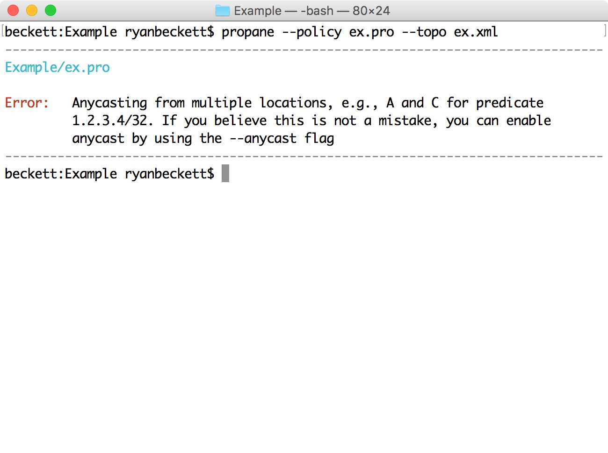
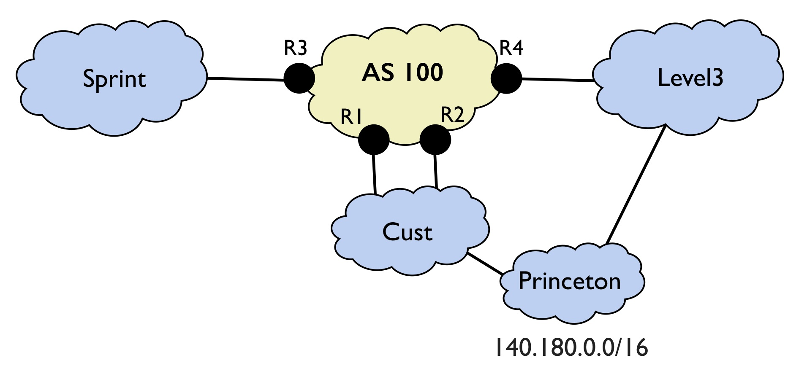

## Language Overview

### Constraints

We will now look at how to write and understand Propane policies. The main building block in Propane is the constraint block, which associates prefixes with routing constraints. For example, the following policy adds the constraint that traffic destined for `1.2.3.4` should take a path that avoids location `B`.

    define main = {
      1.2.3.4 => avoid(B)
    }

Intuitively, you can think of each constraint as representing a set of (ranked) paths that are allowed by the policy. The network is free to choose any path dynamically, so long as it is in this set. In particular, each router in the network will use its most preferred (lowest ranked) path in this set. For example, the constraint `avoid(B)` represents the set of all paths that do not contain `B`. Each router would choose use its best path from this set.

### Combinators

A single routing constraint is often not enough to capture the entire policy. In fact, if we tried to compile the example above for topology from the previous section, we would get the following compile-time error:

 

What does this error mean? The compiler has recognized that we have not constrained the routing policy to specify a destination location. By leaving the destination unspecified, it would be anycasted from every router. This is almost certainly not correct here, so we can add another constraint to the policy for the end point. 

    define main = {
      1.2.3.4 => avoid(B) & end(D)
    }

Intuitively, the `&` operator ensures that both constraints are satisfied. This can be thought of as taking the set intersection of the allowed paths. The `avoid(B)` constraint defines paths that do not go through `B`, and the `end(D)` constraint defines all paths with a final hop of `D`. By intersecting these constraints, we are left with a set of paths both ending at `D` **and** avoiding `B`. Suppose now we wish to allow traffic to end up at either router `C` or router `D` (e.g., to anycast a service). We can allow this possibility using the `+` operator:

    define main = {
      1.2.3.4 => avoid(B) & end(C + D)
    }

The `+` operator takes the set union of paths. In this case, it allows traffic to end either at `C` **or** `D`. Note that operators can be used inside constraints, where `end(C + D)` is equivalent to `end(C) + end(D)`. 
Now suppose we want to allow traffic to reach C or D from every router in our network except router A. In this case, we can use the `not` operator. We can modify the policy as follows:

    define main = {
      1.2.3.4 => not start(A) & avoid(B) & end(C + D)
    }

The `not` combinator negates a set of paths. In this case `start(A)` describes all paths that start at router `A`, while `not start(A)` describes all paths that do not start at `A`. The `not` operator binds more tightly than other operators, so it applies only to the `start(A)` constraint in this example. 

The last combinator is the preference `>>` operator. The semantics of `>>` is that the constraint on the left should always be satisfied when possible. When it is not possible to satisfy the constraint (e.g., due to network failures), the constraint on the right should be satisfied instead. For example, suppose we prefer that traffic traverses middlebox `M` when possible, but any path is fine when this is not possible. We might write a policy that looks like the following:

    define main = {
      1.2.3.4 => (through(B) >> any) & end(D)
    }

This policy says to satisfy constraint `through(M)` when possible. When this is not possible due to failures, the constraint `any` applies, which allows any path. We can compose this preference with the additional constraint that traffic ends up at router `D`. The `>>` operator can be thought of as similar to the union (`+`) operator, but it associates a rank with paths. Paths satisfying the constraint on the left have a better rank than those on the right. Propane ensures all routers get their best possible ranked path according to the policy, given the network failures that have occurred.
 

### Special Values

Propane includes two special values: **in** and **out**. The first value, **in**, denotes a set containing all of the routers that are internal to the network. If our network contains 3 internal routers: X,Y,Z, then we can think of **in** as a special value equivalent to:

    define in = X + Y + Z

The second special value: **out** matches any external AS. This could either be a directly connected peer AS, or any other external downstream AS. For example, the constraint `end(out)` means that the traffic is external and should leave our network.

### Constraint reference

The complete list of Propane constraints is shown below.

Constraint           | Example                   | Meaning                                                   |
---------------------|:--------------------------|:----------------------------------------------------------|
end                  | end(A + B)                | Traffic ultimately ends up at A or B                      |
start                | start(A)                  | Only traffic leaving A is allowed                         |
enter                | enter(as100)              | Traffic should enter through peer as100                   |
exit                 | exit(Peer1)               | Traffic should exit through Peer1                         |
path                 | path(A,B,C,...)           | Traffic must follow the exact path A,B,C,...              |
reach                | reach(A,B)                | Router A should be able to send to destination B          |
always               | always(A+B+C)             | Every hop along the path should match A or B or C         |
internal             | internal                  | The path should stay inside our network                   |
through              | through(M1 + M2)          | Ensure traffic goes through location (or AS) M1 or M2     |
avoid                | avoid(B)                  | Avoid using a path that goes through location B           |
valleyfree           | valleyfree(A+B, C+D, ...) | Prevent valley routing in a dataceter with tiers A+B, ... |
any                  | any                       | Matches and allows any path                               |
drop                 | drop                      | The empty set of paths, drops traffic                     |

### Modularity and Abstraction

The ability to write modular policies and to create new, reusable abstractions is important. Propane supports features for both of these tasks. To see how this works, lets consider writing a configuration for a backbone network, depicted below:

 

You can find the topology and policy for this example in the `Example2/` directory.
In this example, we are configuring a backbone network. There are four internal routers `R1-R4` and three external neighbors, peers `Sprint` and `Level3`, and customer `Cust`. The topology file is shown below. 

**ex2.xml**

    <topology asn="100">
      <!-- Internal routers -->
      <node internal="true" name="R1"></node>
      <node internal="true" name="R2"></node>
      <node internal="true" name="R3"></node>
      <node internal="true" name="R4"></node>
      
      <!-- External Peers -->
      <node internal="false" asn="200" name="Cust"></node>
      <node internal="false" asn="300" name="Sprint"></node>
      <node internal="false" asn="400" name="Level3"></node>
      
      <!-- Full mesh connectivity -->
      <edge source="R1" target="R2"></edge>
      <edge source="R1" target="R3"></edge>
      <edge source="R1" target="R4"></edge>
      <edge source="R2" target="R3"></edge>
      <edge source="R2" target="R4"></edge>
      <edge source="R3" target="R4"></edge>

      <!-- Connections to neighbors -->
      <edge source="R1" target="Cust"></edge>
      <edge source="R2" target="Cust"></edge>
      <edge source="R3" target="Sprint"></edge>
      <edge source="R4" target="Level3"></edge>
    </topology>

Note that for external neighbors `Sprint`, `Level3`, and `Cust`, we include their AS number in the topology file.
Also, although we know `Princeton` is connected to `Cust` we will not add this information into the topology description.

The policy we want to implement is roughly the following:

  * Never send traffic destined to private address space (e.g., `10.0.0.8`)
  * Prefer to send traffic directly to customer `Cust` rather than through peers
  * Prefer to use the better link from `R2` to `Cust` over the link `R1` to `Cust`
  * Prevent becoming a transit point between `Sprint` and `Level3`
  * For security, ensure traffic for `140.180.0.0/16` ends up at `Princeton`

Lets start by creating a few definitions to name prefixes and peers.

    define Princeton = as500
    define Peer = {Sprint, Level3}
    define private = 
      10.0.0.0/[8..32] or 
      172.16.0.0/[12..32] or 
      192.168.0.0/[16..32] or 
      169.254.0.0/[16..32]

This defines `Princeton` to be AS number 500. Even though it is not included in our topology file, we can refer to other ASes such as `Princeton` by directly referring to its AS number. The second line defines a `Peer` (with free exchange of traffic) to be the set containing `Sprint` and `Level3`. The set notation is just syntactic sugar for set union (`Sprint + Level3`). The last definition defines private address space as a range of different prefixes. The notation `10.0.0.0/[8..32]` means any prefix for `10.*.*.*` with length between 8 and 32 inclusive. We use the `or` operator to match any of a number of different prefixes. 

Let us now implement the first three parts of the specification. For all traffic, we want to prefer `Cust` over peers, and to prefer `R2` over `R1`. We can add these constraints with the following Propane definition:

    define prefs = {
      private => drop,
      true => exit(R2 >> Cust >> Peer)
    }

The first line says to perform a network-wide drop for private addresses. If we wanted to use private address space inside our network, we could have added the constraint `private => internal` instead. 
The second line applies to only public addresses and says that we want to leave through `R2` if possible, otherwise leave through any exit point to `Cust` (in this case, that's just `R1`), and then `Peer` if neither is possible. 

Next, we can define what transit traffic is. Intuitively, transit traffic between peers X and Y is traffic that enters the network through X and leaves through Y, or vice-versa. We can capture this definition as follows: 

    define transit(X,Y) = (enter(X) & exit(Y)) + (enter(Y) & exit(X))

Because Propane does not consider paths with loops, if we wanted, we could simplify this definition to the following equivalent definition:

    define transit(X,Y) = enter(X+Y) & exit(X+Y)

Now lets add the constraint that we want to prevent transit traffic between Peers:

    define notransit = {
      true => not transit(Peer,Peer)
    }

Finally, we can add the constraint that traffic destined for `140.180.0.0/16` should end up at princeton.

    define ownership = {
      148.180.0.0/16 => end(Princeton)
    }

The final policy will combine all of these constraints together. We define a `main` constraint as before, but now we combine the `prefs`, `notransit`, and `ownership` constraints together using the same `&` operator.

    define Princeton = as500
    define Peer = {Sprint, Level3}

    define prefs = {
      private => drop,
      true => exit(R2 >> Cust >> Peer)
    }

    define transit(X,Y) = enter(X+Y) & exit(X+Y)

    define notransit = {
      true => not transit(Peer,Peer)
    }

    define ownership = {
      148.180.0.0/16 => end(Princeton)
    }

    define main = prefs & notransit & ownership

Propane combines constraint blocks by joining constraints prefix-by-prefix using the operator specified. For example, when we join the `prefs` and `notransit` with the `&` operator, the compiler realizes that the `not transit(Peer,Peer)` constraint should apply both to private and public addresses and will combine this constraint with the existing `drop` and `exit(R2 >> Cust >> Peer)` constraints using the `&` operator.