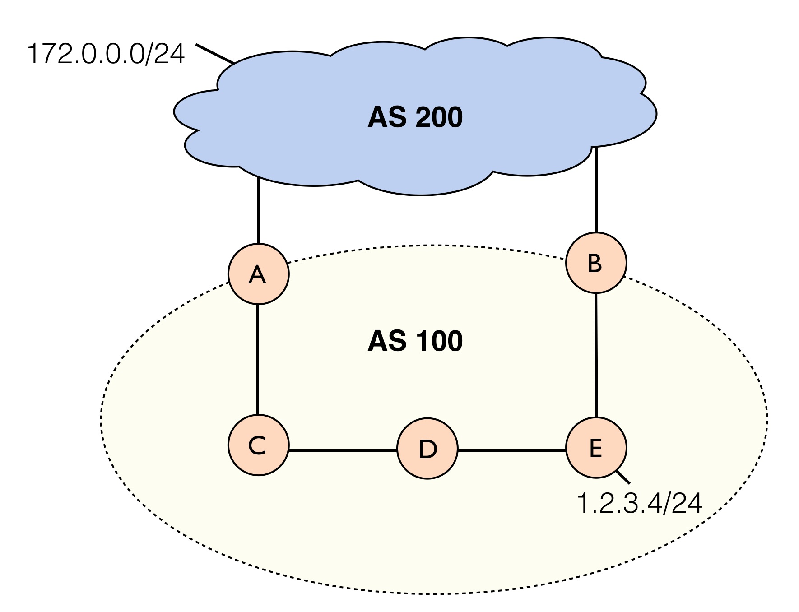

## 1) Example Implementation

Consider the topology shown below:

Here we are configuring the routing policy for AS 100. Our network connects to peer AS 200 at both router A and router B. We have subnet `1.2.3.4/24` located at router E, and our peer owns the prefix subnet `172.0.0.0/24`. For this example, assume that A and B are located on different ends of the country (e.g., west coast for A and east cost for B).

#### Hot Potato Routing

Under normal circumstances, the network will perform what is known as **hot potato** routing. This means that each network will try to hand off the traffic to the other network as quickly as possible. For example, to send traffic for `172.0.0.1`, by default router E will send traffic along the shortest path to neighbor AS 200 on the east coast (router B). AS 200 will then bear the burden of carrying the traffic across the country. Similary, to send traffic to `1.2.3.4`, AS 200 might hand the traffic off to AS 100 at router A. AS 100 will then have to carry the traffic across the country to E.

#### Cold Potato Routing

Suppose now that AS 200 has a slower network, and we want to improve Quality of Service for our customers. We might implement what is known as **cold potato** routing. We wish to keep the traffic under the control of our network for as long as possible. In particular, for prefix `172.0.0.0/24`, we wish to carry the traffic through our network to the closest exit point (router A) to the destination. 
However, in doing so, we might now create asymmetric paths. The return traffic to router E will still go through AS 200's network. As a result, we would also like traffic for router E to return from the closest entry point into the network. 

#### Implementation

Write a Propane policy that implements cold potato routing for this toy example. The policy should do the following:

  1. Prefer to carry traffic for addresses in the subnet `172.0.0.0/24` through the network to AS 200 via router A
  2. Prefer to carry return traffic for addresses in the subnet `1.2.3.4/24` through router A as well
  3. Allow going through B as a backup in case of failures

**Question**: What BGP mechanism(s) does Propane use to implement each of these policies? 

## 2) BGP Instability 

Recall the BGP Bad Gadget example from before.
Do you think the Propane language can express the BGP Bad Gadget example? If so, give the policy and see it will compile the example. If not, why can't this policy be expressed in Propane?

## What to Turn In

Submit a compressed zip file containing the following for the assignment:

  1. The topology (.xml) and Propane policy (.pro) files used for the cold potato routing example.
  2. In a separate `answers.txt` file, answer the question about what BGP mechanism(s) Propane uses for this example.
  3. In the same `answers.txt` file, also answer the question about expressing the BGP Bad Gadget in Propane.